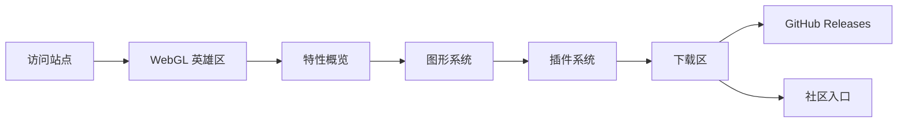

## 1. 产品概述

EpsilonBC 官网是 BlockConnect 社区维护的 Minecraft 多加载器实用工具客户端 EpsilonBC 的门户站点，用于向玩家与开发者展示项目定位、图形系统、插件生态、下载入口与社区链接。
- 目标用户：Minecraft 玩家、模组开发者、客户端使用者；解决「项目归档后社区分支缺少统一对外窗口」的问题
- 价值：作为 EpsilonBC 的唯一对外品牌入口，承载功能介绍、版本发布与社区导流，部署至 GitHub Pages 并使用自定义域名 epsilonbc.n0th1n3ssd0ma1n.top

## 2. 核心功能

### 2.2 功能模块
1. **首页（单页滚动）**：WebGL 英雄区、特性概览、图形系统、插件系统、下载、社区、页脚
2. **导航栏**：锚点跳转、版本徽章、GitHub 入口
3. **下载区**：稳定版（26.1.x）与开发版（26.2.x）切换、NeoForge / Fabric / Forge 加载器标签、GitHub Releases 跳转

### 2.3 页面明细
| 页面名称 | 模块名称 | 功能描述 |
|-----------|-------------|---------------------|
| 首页 | WebGL 英雄区 | ε 晶体发光场景，标题、副标题、CTA 按钮 |
| 首页 | 特性概览 | 多加载器、Lumin 图形、模块化、插件系统四项特性 |
| 首页 | 图形系统 | Lumin 渲染管线能力清单（矩形/圆角/阴影/模糊/TTF/纹理） |
| 首页 | 插件系统 | Addon 开发入口与跨加载器说明 |
| 首页 | 下载 | 版本与加载器切换，跳转 GitHub Releases |
| 首页 | 社区 | BlockConnect QQ 群、Discord、原项目致谢 |
| 首页 | 页脚 | GPLv3 许可、版权、致谢、分支说明 |

## 3. 核心流程

用户进入站点 → WebGL 英雄区建立品牌印象 → 滚动浏览特性 → 进入下载区选择版本与加载器 → 跳转 GitHub Releases 获取构建 → 加入社区。

## 4. 用户界面设计

### 4.1 设计风格
- 主色：深空黑 #0A0B0F 背景 + Lumin 青蓝 #5EEAD4 / 微光紫 #8B7CFF 双辉光强调色
- 次要色：中性灰阶用于文本层级
- 按钮：扁平胶囊形，主按钮带辉光投影
- 字体：标题用 Space Grotesk 替代品（选用 Manrope/Geist 避免常见），正文用 Inter Tight；中文用 LXGW WenKai 或系统字体
- 布局：全宽分屏式纵向滚动，反对卡片网格；使用大留白、几何分隔线、不对称构图
- 图标：线性极简 SVG，无 emoji

### 4.2 页面设计概览
| 页面名称 | 模块名称 | UI 元素 |
|-----------|-------------|-------------|
| 首页 | 英雄区 | 深色背景、WebGL ε 晶体、大号标题、辉光 CTA |
| 首页 | 特性 | 横向分栏、序号编号、悬浮微动效 |
| 首页 | 图形系统 | 左文右图、渲染管线可视化条 |
| 首页 | 下载 | 版本切换 Tab、加载器标签矩阵 |
| 首页 | 社区 | 大号链接列表、背景渐隐 |

### 4.3 响应式
桌面优先，移动端自适应折叠为单列；WebGL 在低端设备降级为静态辉光背景。

### 4.4 3D 场景指引
- 环境：深空黑场景，低环境光 + 青蓝点光 + 紫色补光
- 主体：ε 形状的发光晶体或扭转多面体，自转 + 鼠标视差
- 后期：Bloom 辉光、噪点颗粒
- 相机：固定视角微动，跟随鼠标位移
- 性能：限制像素比 ≤ 2，空闲时降帧
