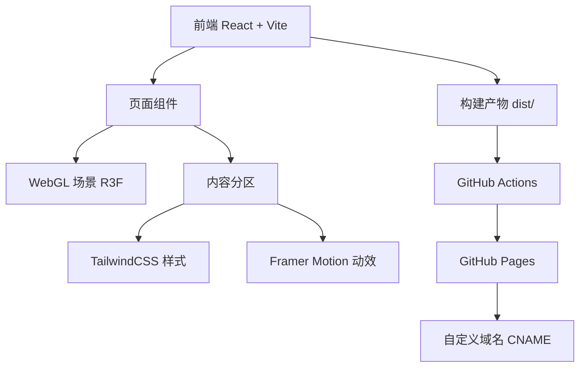

## 1. 架构设计

## 2. 技术说明
- 前端：React 18 + Vite 5 + TypeScript
- 样式：TailwindCSS 3
- 3D：three + @react-three/fiber + @react-three/drei + @react-three/postprocessing
- 动效：Framer Motion
- 路由：单页锚点滚动（不使用 React Router）
- 部署：GitHub Pages，base 路径为 `/`（自定义域名根路径部署）
- 初始化工具：vite-init

## 3. 路由定义
| 路由 | 用途 |
|-------|---------|
| / | 单页站点，包含所有分区锚点（#hero #features #graphics #addon #download #community） |

## 4. API 定义
无后端。下载链接直跳 GitHub Releases API 页面：`https://github.com/NDBlockConnect/EpsilonBC/releases`。

## 5. 服务器架构
无后端服务，纯静态站点由 GitHub Pages 托管。

## 6. 数据模型
无持久化数据。版本与加载器信息以静态常量形式内联于 `src/data/releases.ts`，内容来源为 GitHub 仓库 README 与 Releases 页面，无 Mock 数据。
