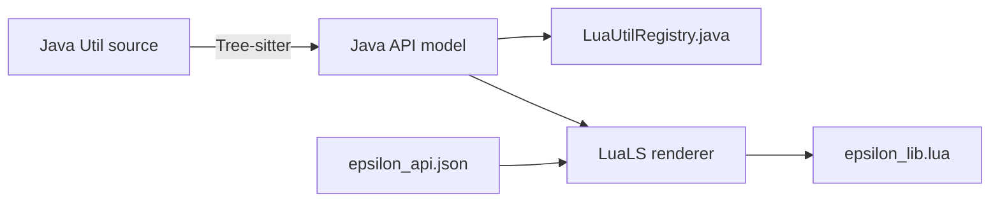

# Util 简写与代码补全

Epsilon 为经过显式筛选的 Java Util 提供短名绑定，并由同一个 Python codegen 生成运行时注册表和 LuaLS
类型库。脚本不需要重复书写完整 Java 包名，VS Code 也能根据字符串字面量推导具体 class：

```lua
local PlayerUtils = luajava.bindUtilClass("PlayerUtils")

if mc.player ~= nil and PlayerUtils:isEating() then
    print("player is eating")
end
```

输入 `PlayerUtils:` 时，LuaLS 会补全当前 Java 源码中公开的 `isEating()`、`isInWeb()` 和 `isInBlock()`。
`bindUtilClass` 仍返回 LuaJ 的 Java class userdata；类型库只为编辑器补充精确类型，不改变运行时调用规则。

## 启用类型库

VS Code workspace 的 `.luarc.json` 需要把仓库的 `docs/examples/lua` 加入 library：

```json
{
  "$schema": "https://raw.githubusercontent.com/LuaLS/vscode-lua/master/setting/schema.json",
  "runtime.version": "Lua 5.2",
  "workspace.library": [
    "D:/Dev/OpenEpsilon/Open-Epsilon/docs/examples/lua"
  ],
  "workspace.checkThirdParty": false
}
```

将路径替换为本机仓库的绝对路径，然后执行 `Lua: Restart Language Server`。生成的
[`epsilon_lib.lua`](../examples/lua/epsilon_lib.lua) 带有 `---@meta`，只供编辑器读取；脚本中不要
`require("epsilon_lib")`。

## 静态方法和字段

Java static 方法使用绑定后的 class 调用：

```lua
local ClientUtils = luajava.bindUtilClass("ClientUtils")
local KeybindUtils = luajava.bindUtilClass("KeybindUtils")

if ClientUtils:isLoading() then return end

local noKey = KeybindUtils.NONE
local mouseCode = KeybindUtils:encodeMouseButton(0)
print(KeybindUtils:format(mouseCode), noKey)
```

公开字段会生成 `---@field`。`public final` 字段标记为 `readonly`；非 final 字段仍会显示为可写，但脚本必须
自行遵守对应 Java 类的状态约束。

## 重载

同名 Java 方法的全部公开签名会生成 LuaLS `---@overload`。例如 `ChatUtils.addChatMessage` 接受 `String`、
`Component`、可选前缀和消息 hash 等多组签名：

```lua
local ChatUtils = luajava.bindUtilClass("ChatUtils")

ChatUtils:addChatMessage("loaded")
ChatUtils:addChatMessage(false, "message without prefix")
ChatUtils:addChatMessage("replaceable message", 0x455053)
```

补全库能展示候选签名，但最终重载选择仍由 LuaJ 执行。Lua 的 `number` 同时可能匹配多个 Java 数值类型；当
多个重载只在 `int`、`long`、`float` 或 `double` 上不同时，应确认实参能唯一匹配，不能把编辑器提示视为
运行时强制转换。

## 实例和构造器

包含公开构造器的 Util 会同时生成 `Class` 和实例类型，并给 `luajava.new`、`newInstance` 增加构造器
overload。`TimerUtils` 是最直接的例子：

```lua
local TimerUtils = luajava.bindUtilClass("TimerUtils")
local timer = luajava.new(TimerUtils)

module:on_enable(function()
    timer:reset()
end)

module:on("client_tick.post", 0, function(event)
    if timer:every(1000) then
        print("one second elapsed")
    end
end)
```

也可以使用全限定类名构造同一个类型：

```lua
local timer = luajava.newInstance("com.github.epsilon.utils.timer.TimerUtils")
```

只有 public 构造器会进入补全。public class 没有显式声明构造器时，生成器会建模 Java 提供的 public 隐式
无参构造器；只有 private 构造器的纯静态工具类不会生成构造 overload。

## Varargs

Java 可变参数会映射成 Lua 的 `...`，元素仍按 Java 参数类型检查和提示：

```lua
local InvUtils = luajava.bindUtilClass("InvUtils")
local Items = luajava.bindClass("net.minecraft.world.item.Items")

local result = InvUtils:findInHotbar(Items.OBSIDIAN, Items.CRYING_OBSIDIAN)
if result:found() then
    print("slot: " .. result:slot())
end
```

`FindItemResult` 没有登记为短名 Util，因此返回值在生成库中保持 Java `userdata`。LuaJ 运行时仍能调用它的
公开方法；当前自动生成范围不承诺为任意返回对象继续递归生成成员补全。

## Nullable 返回值

源码中的 `@Nullable` 会在 LuaLS 类型后增加 `|nil`。例如屏幕投影可能没有可用结果：

```lua
local WorldToScreen = luajava.bindUtilClass("WorldToScreen")

module:on("render2d.level", 0, function(ui, event)
    if mc.player == nil then return end

    local screen = WorldToScreen:calcWorld2Screen(mc.player:position())
    if screen == nil then return end

    ui:rect(screen.x - 2, screen.y - 2, 4, 4, 0xFFFFFFFF)
end)
```

没有 nullable annotation 时，生成器不会根据方法实现猜测 `null`。如果 Java API 实际可返回 null，应先在
Java 源码补充正确的 nullable annotation，再重新生成类型库。

## 嵌套 enum

公开嵌套 enum 使用 JVM binary name，也就是 `Outer$Inner`，而不是 Java 源码中的点号：

```lua
local DamageUtils = luajava.bindUtilClass("DamageUtils")
local ArmorMode = luajava.bindClass(
    "com.github.epsilon.utils.combat.DamageUtils$ArmorEnchantmentMode"
)

if mc.player == nil then return end

local predictedDamage = DamageUtils:selfCrystalDamage(
    mc.player:position(),
    ArmorMode.PPBP
)
```

生成器会为 `bindClass` 添加该 binary name 的 overload，并补全 `None`、`PPPP`、`PPBP` 等 enum 常量。

## 类型映射

| Java 源码类型 | LuaLS 类型 |
|---|---|
| `boolean` / `Boolean` | `boolean` |
| 整数 primitive/wrapper | `integer` |
| `float` / `double` 及 wrapper | `number` |
| `char` / `Character`、`String` / `CharSequence` | `string` |
| 已注册 Util 实例 | 对应的 `EpsilonJava*` 类型 |
| 已发现的公开嵌套 enum | 对应的 enum 类型 |
| 其他 Java object、generic、collection、数组 | `userdata` |
| 带 `@Nullable` 的类型 | 原映射类型加 `|nil` |

每个生成的参数、返回值和字段旁会保留 Java 源码类型，例如：

```lua
---@param entity userdata Java type: `LivingEntity`.
---@return userdata|nil value Java type: `Vector3f`.
```

Java collection 和数组不会映射为 Lua table。它们的索引、迭代和修改行为仍由对应 Java API 与 LuaJ interop
决定。

## 当前短名范围

生成器扫描 `com.github.epsilon.utils`，只选择 public 顶层 `*Utils` class，以及配置中明确加入的非后缀
入口。当前额外入口是 `WorldToScreen`。内部类、record、顶层 enum、非 public class 和其他未登记 helper
不会因为位于 `utils/` 目录就自动成为脚本公共 API。

短名必须全局唯一。新增两个同名 Util 时生成会失败，不会根据目录或扫描顺序任选其一。当前完整短名列表以
[`epsilon_lib.lua`](../examples/lua/epsilon_lib.lua) 的 `EpsilonUtilClassName` 为准。

## 生成器结构

codegen 的输入分为两部分：

- Java AST：从 Util、事件 registry 和 Lua host API 导出点获取运行时事实。
- [`epsilon_api.json`](../../scripts/lua_codegen/epsilon_api.json)：描述不能从 Util AST 推导的 alias、class、
  field、method、overload 和 global。

生成流程为：



Python 代码分工如下：

| 文件 | 职责 |
|---|---|
| `scripts/dev.py` | 统一命令入口，编排 Lua 生成/验证并转发 i18n 参数 |
| `scripts/generate_epsilon_lib.py` | 读取输入、校验 Java 导出、组织两个生成产物和 `--check` |
| `scripts/lua_codegen/java_utils.py` | Tree-sitter Java 解析与结构化成员模型 |
| `scripts/lua_codegen/api_model.py` | 加载并校验 JSON 静态 API 模型 |
| `scripts/lua_codegen/lua_renderer.py` | 合并静态 API 和 Util API，渲染 LuaLS annotation |
| `scripts/lua_codegen/epsilon_api.json` | 非 Util Lua host API 的数据源 |

`epsilon_api.json` 不是任意 Lua 文本片段集合。例如一个 host API 方法使用结构化数据表示：

```json
{
  "name": "bindEventClass",
  "call": "dot",
  "parameters": [
    {"name": "eventName", "type": "EpsilonEventClassName"}
  ],
  "returns": [
    {"type": "userdata", "name": "javaClass"}
  ]
}
```

Util 的字段和方法不要手工复制进 JSON；修改 Java 源码后由 AST 自动发现。JSON 只维护 `module`、`addon`、
渲染 context、setting spec 和 `luajava` 扩展等静态 host API。

## 重新生成和检查

仓库使用 `uv.lock` 固定 Tree-sitter 版本。在仓库根目录运行：

```powershell
uv sync --frozen
uv run scripts/dev.py lua update
```

生成器同时更新：

- `common/src/main/java/com/github/epsilon/scripting/lua/LuaUtilRegistry.java`
- `docs/examples/lua/epsilon_lib.lua`

不要直接修改这两个生成产物。新增、删除或修改公开 Util 成员后重新运行生成器，并把 Java 源码、JSON 模型
（如有变化）、Python codegen 和两个生成结果放在同一次提交中。`--check` 非零退出表示生成产物已经过期，
或 Java 导出与 JSON 模型不一致。

更底层的发现规则和测试命令见 [`scripts/README.md`](../../scripts/README.md)，Java interop 的线程与安全边界
见 [事件与 Java 调用](events-and-java.md)。
